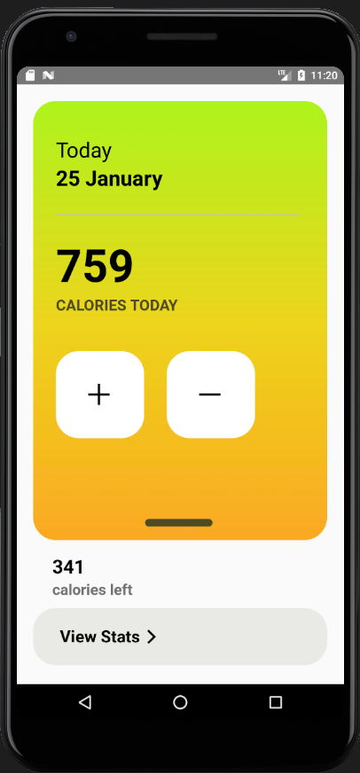
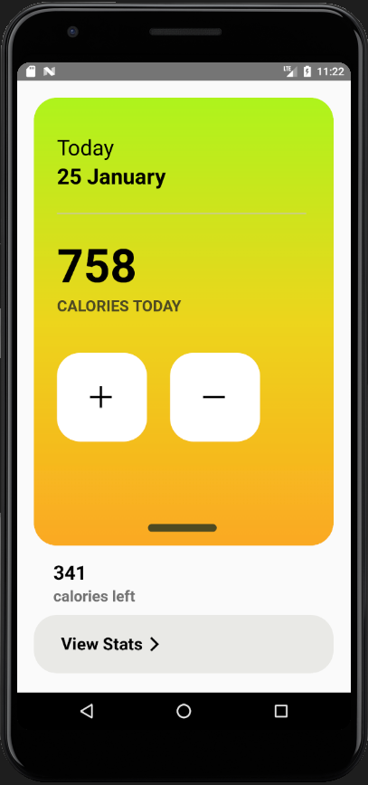

## Assignment 3

(NOTE: Please switch to 'context' branch for Assignment 5: State management using Context API)

Inspired from https://dribbble.com/shots/9832992-Calories-Counter-mobile-app

 
Screenshot 1
 

 
Screenshot 2 / Incrementing the counter
 

 
Screenshot 3 / Decrementing the counter
 

